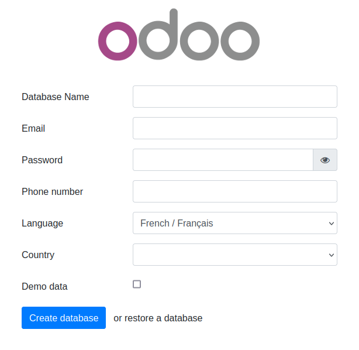
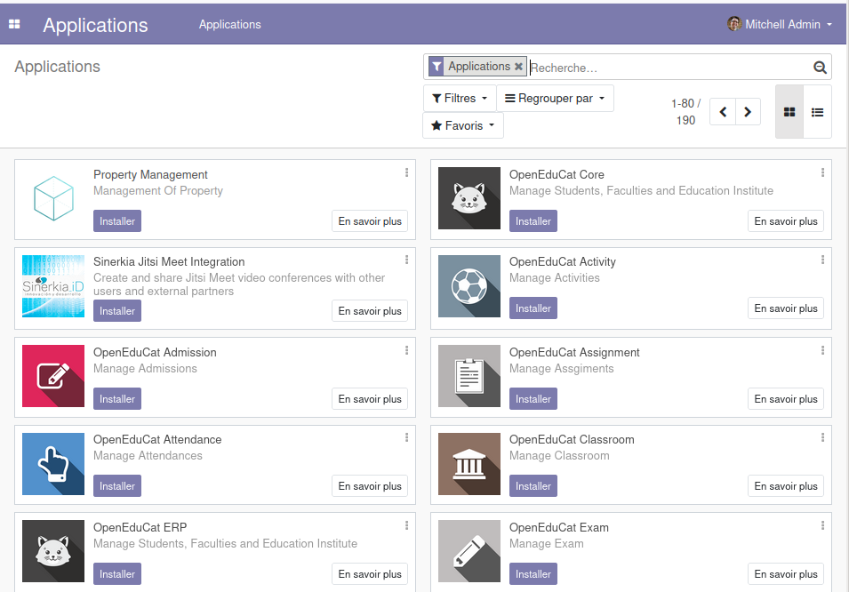

<!---------------------------->
<!-- multilingual suffix: en, fr -->
<!-- no suffix: en -->
<!---------------------------->

<!-- [common] -->

# ERPLibre

<!-- [en] -->

ERPLibre is a CRM/ERP platform including automated installation, maintenance, and development of open source modules of
the Odoo community version. It is a "soft-fork" of the Odoo Community Edition (OCE), meaning it aims at contributing
back upstream.
It is based on a set of production-ready modules, supported by the Odoo Community Association (OCA) and an
ecosystem of specialized companies. This solution ensures digital sovereignty in a local environment while integrating
pre-trained Generative Transformers (GPT), bringing an additional dimension to data management and automation.

<!-- [fr] -->

ERPLibre est une plateforme CRM/ERP incluant l'installation, la maintenance et le developpement automatises de modules
open source de la version communautaire d'Odoo. C'est un "soft-fork" de l'Odoo Community Edition (OCE), ce qui signifie
qu'il vise a contribuer en amont.
Il est base sur un ensemble de modules prets pour la production, supportes par l'Odoo Community Association (OCA) et un
ecosysteme d'entreprises specialisees. Cette solution assure la souverainete numerique dans un environnement local tout
en integrant des Transformers Generatifs Pre-entraines (GPT), apportant une dimension supplementaire a la gestion des
donnees et a l'automatisation.

<!-- [en] -->

Follow us on Mastodon : https://fosstodon.org/@erplibre

<!-- [fr] -->

Suivez-nous sur Mastodon : https://fosstodon.org/@erplibre

<!-- [en] -->

# Features

- **Multi-version Odoo support** : run Odoo 12.0, 13.0, 14.0, 15.0, 16.0, 17.0 and 18.0 in the same workspace, with independent Python virtual environments (`.venv.erplibre` and `.venv.odooXX`)
- **Interactive CLI (TODO.py)** : guided interactive tool for installation, execution, database management, code formatting, mobile compilation, and more. Launch it with `make`
- **Code generator** : generate Odoo modules automatically with support for views, portal, snippets, inheritance, i18n, and JavaScript
- **Selenium automation** : web testing and automation with Selenium Grid, video recording, and login automation
- **Mobile application** : ERPLibre Home Mobile (Owl + Capacitor), compiled and deployed via TODO.py
- **Docker deployment** : production-ready Docker images with PostgreSQL 18 and PostGIS
- **Deployment tools** : Nginx, Apache, Cloudflare DDNS, Certbot SSL, systemd services
- **Database tools** : backup, restore, clone, migration between versions, production-to-dev migration
- **Performance tools** : request-per-second measurement, parallel test execution, coverage analysis

<!-- [fr] -->

# Fonctionnalites

- **Support multi-version Odoo** : executez Odoo 12.0, 13.0, 14.0, 15.0, 16.0, 17.0 et 18.0 dans le meme espace de travail, avec des environnements virtuels Python independants (`.venv.erplibre` et `.venv.odooXX`)
- **CLI interactif (TODO.py)** : outil interactif guide pour l'installation, l'execution, la gestion de bases de donnees, le formatage de code, la compilation mobile, et plus encore. Lancez-le avec `make`
- **Generateur de code** : generez des modules Odoo automatiquement avec support des vues, portail, snippets, heritage, i18n et JavaScript
- **Automatisation Selenium** : tests web et automatisation avec Selenium Grid, enregistrement video et automatisation de connexion
- **Application mobile** : ERPLibre Home Mobile (Owl + Capacitor), compilee et deployee via TODO.py
- **Deploiement Docker** : images Docker pretes pour la production avec PostgreSQL 18 et PostGIS
- **Outils de deploiement** : Nginx, Apache, Cloudflare DDNS, Certbot SSL, services systemd
- **Outils de base de donnees** : sauvegarde, restauration, clonage, migration entre versions, migration production vers developpement
- **Outils de performance** : mesure de requetes par seconde, execution de tests en parallele, analyse de couverture

<!-- [en] -->

# Supported Odoo versions

<!-- [fr] -->

# Versions Odoo supportees

<!-- [common] -->

| Odoo version | Python  | Status     |
|--------------|---------|------------|
| 18.0         | 3.12.10 | Active     |
| 17.0         | 3.10.18 | Inactive   |
| 16.0         | 3.10.18 | Inactive   |
| 15.0         | 3.8.20  | Deprecated |
| 14.0         | 3.8.20  | Deprecated |
| 13.0         | 3.7.17  | Deprecated |
| 12.0         | 3.7.17  | Deprecated |

<!-- [en] -->

Switch between versions with `make switch_odoo_18`, `make switch_odoo_16`, etc.

<!-- [fr] -->

Changez de version avec `make switch_odoo_18`, `make switch_odoo_16`, etc.

<!-- [en] -->

# Supported platforms

- **Linux** : Ubuntu 20.04, 22.04, 24.04, 25.04; Debian 12; Arch Linux
- **macOS** : via pyenv
- **Windows** : via WSL or Docker
- **Mainframe** : 390x architecture

<!-- [fr] -->

# Plateformes supportees

- **Linux** : Ubuntu 20.04, 22.04, 24.04, 25.04; Debian 12; Arch Linux
- **macOS** : via pyenv
- **Windows** : via WSL ou Docker
- **Mainframe** : architecture 390x

<!-- [en] -->

# Installation

## Easy installation on Ubuntu or Debian using Docker

This has been tested in Debian 12 and Ubuntu 24.04 LTS.

**Note** : This is meant for a test environment, on a local network or similar environment not directly exposed to the
Internet.

<!-- [fr] -->

# Installation

## Installation facile sur Ubuntu ou Debian avec Docker

Ceci a ete teste sur Debian 12 et Ubuntu 24.04 LTS.

**Note** : Ceci est prevu pour un environnement de test, sur un reseau local ou un environnement similaire non expose
directement a Internet.

<!-- [en] -->

1. Make sure Docker and nginx web server are installed:<BR>
   ```sudo apt install docker.io docker-compose-v2 nginx```
1. Get the latest ERPLibre Docker compose file:<BR>
   ```wget https://raw.githubusercontent.com/ERPLibre/ERPLibre/v1.6.0/docker-compose.yml```
1. Install and run ERPLibre with Docker running as a daemon (web server):<BR>
   ```sudo docker compose up -d```
1. Open the final installation step at this web page :<BR>
   ```http://[server IP]:8069```<BR>
   
1. Finish the installation by providing a database name, email and password. then click on **Create Database**.
   Depending on your system resources **this may take more than 2 minutes without feedback !** Check your browser
   loading indicator.
1. Next, the web page will reload itself, and you should see the Applications list in ERPLibre:<BR>
   

   You can now personalize your ERPLibre installation.

<!-- [fr] -->

1. Assurez-vous que Docker et le serveur web nginx sont installes :<BR>
   ```sudo apt install docker.io docker-compose-v2 nginx```
1. Obtenez le dernier fichier Docker compose d'ERPLibre :<BR>
   ```wget https://raw.githubusercontent.com/ERPLibre/ERPLibre/v1.6.0/docker-compose.yml```
1. Installez et lancez ERPLibre avec Docker en mode daemon (serveur web) :<BR>
   ```sudo docker compose up -d```
1. Ouvrez l'etape finale d'installation a cette page web :<BR>
   ```http://[server IP]:8069```<BR>
   
1. Terminez l'installation en fournissant un nom de base de donnees, un courriel et un mot de passe, puis cliquez sur **Create Database**.
   Selon les ressources de votre systeme, **cela peut prendre plus de 2 minutes sans retour visuel !** Verifiez
   l'indicateur de chargement de votre navigateur.
1. Ensuite, la page web se rechargera automatiquement et vous devriez voir la liste des applications dans ERPLibre :<BR>
   

   Vous pouvez maintenant personnaliser votre installation ERPLibre.

<!-- [en] -->

For more information, read [Docker guide](./docker/README.md).

## Install from source code

### Automated installation

<!-- [fr] -->

Pour plus d'informations, consultez le [guide Docker](./docker/README.md).

## Installation depuis le code source

### Installation automatisee

<!-- [en] -->

For Debian/Ubuntu

<!-- [fr] -->

Pour Debian/Ubuntu

<!-- [common] -->

```bash
sudo apt install make python3
```

<!-- [en] -->

Clone the project:

<!-- [fr] -->

Clonez le projet :

<!-- [common] -->

```bash
git clone https://github.com/ERPLibre/ERPLibre.git
cd ERPLibre
```

<!-- [en] -->

Follow the instruction on the following script, it will try to detect your environment.

<!-- [fr] -->

Suivez les instructions du script suivant, il essaiera de detecter votre environnement.

<!-- [common] -->

```bash
make
```

<!-- [en] -->

### Manually

Into Ubuntu, minimal dependency:

<!-- [fr] -->

### Manuellement

Sous Ubuntu, dependance minimale :

<!-- [common] -->

```bash
sudo apt install make git curl
```

<!-- [en] -->

Into Ubuntu, developer dependency:

<!-- [fr] -->

Sous Ubuntu, dependance developpeur :

<!-- [common] -->

```bash
sudo apt install make build-essential libssl-dev zlib1g-dev libreadline-dev libsqlite3-dev curl llvm libncurses5-dev libncursesw5-dev xz-utils tk-dev liblzma-dev libbz2-dev libldap2-dev libsasl2-dev
```

<!-- [en] -->

Clone the project:

<!-- [fr] -->

Clonez le projet :

<!-- [common] -->

```bash
git clone https://github.com/ERPLibre/ERPLibre.git
cd ERPLibre
```

<!-- [en] -->

Support Ubuntu 20.04, 22.04, 24.04, 25.04 and OSX.

<!-- [fr] -->

Support Ubuntu 20.04, 22.04, 24.04, 25.04 et OSX.

<!-- [common] -->

```bash
make install_os
make install_odoo_18
```

<!-- [en] -->

Install a specific Odoo version:

<!-- [fr] -->

Installez une version specifique d'Odoo :

<!-- [common] -->

```bash
make install_odoo_16
make install_odoo_17
make install_odoo_18
```

<!-- [en] -->

Update your configuration if you need to run from another interface than 127.0.0.1, file `config.conf`

<!-- [fr] -->

Mettez a jour votre configuration si vous devez executer depuis une autre interface que 127.0.0.1, fichier `config.conf`

<!-- [common] -->

```
xmlrpc_interface = 0.0.0.0
```

<!-- [en] -->

Show version :

<!-- [fr] -->

Afficher la version :

<!-- [common] -->

```bash
make version
```

<!-- [en] -->

Ready to execute:

<!-- [fr] -->

Pret a executer :

<!-- [common] -->

```bash
make run
```

<!-- [en] -->

# Test

Execute ERPLibre test with his code generator.

<!-- [fr] -->

# Test

Executez les tests ERPLibre avec son generateur de code.

<!-- [common] -->

```bash
time make test_full_fast
```

<!-- [en] -->

# Documentation

| Guide | Description |
|-------|-------------|
| [DISCOVER](doc/DISCOVER.md) | Learn and explore ERPLibre |
| [DEVELOPMENT](doc/DEVELOPMENT.md) | Development environment setup |
| [PRODUCTION](doc/PRODUCTION.md) | Production server deployment |
| [RUN](doc/RUN.md) | Execution modes and use cases |
| [CODE_GENERATOR](doc/CODE_GENERATOR.md) | Odoo module code generation |
| [MIGRATION](doc/MIGRATION.md) | Database migration between versions |
| [GIT_REPO](doc/GIT_REPO.md) | Git repository management |
| [POETRY](doc/POETRY.md) | Python dependency management |
| [FAQ](doc/FAQ.md) | Frequently asked questions |
| [HOWTO](doc/HOWTO.md) | How-to guides |
| [WINDOWS_INSTALLATION](doc/WINDOWS_INSTALLATION.md) | Windows installation |

<!-- [fr] -->

# Documentation

| Guide | Description |
|-------|-------------|
| [DISCOVER](doc/DISCOVER.md) | Decouvrir et explorer ERPLibre |
| [DEVELOPMENT](doc/DEVELOPMENT.md) | Configuration de l'environnement de developpement |
| [PRODUCTION](doc/PRODUCTION.md) | Deploiement du serveur de production |
| [RUN](doc/RUN.md) | Modes d'execution et cas d'utilisation |
| [CODE_GENERATOR](doc/CODE_GENERATOR.md) | Generation de code de modules Odoo |
| [MIGRATION](doc/MIGRATION.md) | Migration de base de donnees entre versions |
| [GIT_REPO](doc/GIT_REPO.md) | Gestion des depots Git |
| [POETRY](doc/POETRY.md) | Gestion des dependances Python |
| [FAQ](doc/FAQ.md) | Foire aux questions |
| [HOWTO](doc/HOWTO.md) | Guides pratiques |
| [WINDOWS_INSTALLATION](doc/WINDOWS_INSTALLATION.md) | Installation sous Windows |

<!-- [en] -->

# Contributing

See [CONTRIBUTION.md](doc/CONTRIBUTION.md) for guidelines.

<!-- [fr] -->

# Contribution

Consultez [CONTRIBUTION.md](doc/CONTRIBUTION.md) pour les directives.

<!-- [en] -->

# License

This project is licensed under the [GNU Affero General Public License v3.0](LICENSE).

<!-- [fr] -->

# Licence

Ce projet est sous licence [GNU Affero General Public License v3.0](LICENSE).
