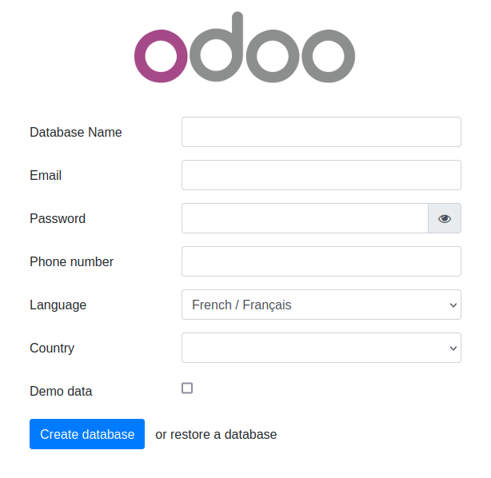

# ERPLibre


ERPLibre is a CRM/ERP platform including automated installation, maintenance, and development of open source modules of
the Odoo community version. It is a "soft-fork" of the Odoo Community Edition (OCE), meaning it aims at contributing
back upstream.
It is based on a set of production-ready modules, supported by the Odoo Community Association (OCA) and an
ecosystem of specialized companies. This solution ensures digital sovereignty in a local environment while integrating
pre-trained Generative Transformers (GPT), bringing an additional dimension to data management and automation.


Follow us on Mastodon : https://fosstodon.org/@erplibre


# Features

- **Multi-version Odoo support** : run Odoo 12.0, 13.0, 14.0, 15.0, 16.0, 17.0 and 18.0 in the same workspace, with independent Python virtual environments (`.venv.erplibre` and `.venv.odooXX`)
- **Interactive CLI (TODO.py)** : guided interactive tool for installation, execution, database management, code formatting, mobile compilation, and more. Launch it with `make`
- **Code generator** : generate Odoo modules automatically with support for views, portal, snippets, inheritance, i18n, and JavaScript
- **Selenium automation** : web testing and automation with Selenium Grid, video recording, and login automation
- **Mobile application** : ERPLibre Home Mobile (Owl + Capacitor), compiled and deployed via TODO.py
- **Docker deployment** : production-ready Docker images with PostgreSQL 18 and PostGIS
- **Deployment tools** : Nginx, Apache, Cloudflare DDNS, Certbot SSL, systemd services
- **Database tools** : backup, restore, clone, migration between versions, production-to-dev migration
- **Performance tools** : request-per-second measurement, parallel test execution, coverage analysis


# Supported Odoo versions


| Odoo version | Python  | Status     |
|--------------|---------|------------|
| 18.0         | 3.12.10 | Active     |
| 17.0         | 3.10.18 | Inactive   |
| 16.0         | 3.10.18 | Inactive   |
| 15.0         | 3.8.20  | Deprecated |
| 14.0         | 3.8.20  | Deprecated |
| 13.0         | 3.7.17  | Deprecated |
| 12.0         | 3.7.17  | Deprecated |


Switch between versions with `make switch_odoo_18`, `make switch_odoo_16`, etc.


# Supported platforms

- **Linux** : Ubuntu 20.04, 22.04, 24.04, 25.04; Debian 12; Arch Linux
- **macOS** : via pyenv
- **Windows** : via WSL or Docker
- **Mainframe** : 390x architecture


# Installation

## Easy installation on Ubuntu or Debian using Docker

This has been tested in Debian 12 and Ubuntu 24.04 LTS.

**Note** : This is meant for a test environment, on a local network or similar environment not directly exposed to the
Internet.


1. Make sure Docker and nginx web server are installed:<BR>
   ```sudo apt install docker docker-compose nginx```
1. Get the latest ERPLibre Docker compose file:<BR>
   ```wget https://raw.githubusercontent.com/ERPLibre/ERPLibre/v1.6.0/docker-compose.yml```
1. Install and run ERPLibre with Docker running as a daemon (web server):<BR>
   ```sudo docker-compose up -d```
1. Open the final installation step at this web page :<BR>
   ```http://[server IP]:8069```<BR>
   
1. Finish the installation by providing a database name, email and password. then click on **Create Database**.
   Depending on your system resources **this may take more than 2 minutes without feedback !** Check your browser
   loading indicator.
1. Next, the web page will reload itself, and you should see the Applications list in ERPLibre:<BR>
   

   You can now personalize your ERPLibre installation.

<!-- [fr] -->

1. Assurez-vous que Docker et le serveur web nginx sont installes :<BR>
   ```sudo apt install docker.io docker-compose-v2 nginx```
1. Obtenez le dernier fichier Docker compose d'ERPLibre :<BR>
   ```wget https://raw.githubusercontent.com/ERPLibre/ERPLibre/v1.6.0/docker-compose.yml```
1. Installez et lancez ERPLibre avec Docker en mode daemon (serveur web) :<BR>
   ```sudo docker compose up -d```
1. Ouvrez l'etape finale d'installation a cette page web :<BR>
   ```http://[server IP]:8069```<BR>
   
1. Terminez l'installation en fournissant un nom de base de donnees, un courriel et un mot de passe, puis cliquez sur **Create Database**.
   Selon les ressources de votre systeme, **cela peut prendre plus de 2 minutes sans retour visuel !** Verifiez
   l'indicateur de chargement de votre navigateur.
1. Ensuite, la page web se rechargera automatiquement et vous devriez voir la liste des applications dans ERPLibre :<BR>
   

   Vous pouvez maintenant personnaliser votre installation ERPLibre.

<!-- [en] -->

For more information, read [Docker guide](./docker/README.md).

## Install from source code

### Automated installation

<!-- [fr] -->

Pour plus d'informations, consultez le [guide Docker](./docker/README.md).

## Installation depuis le code source

### Installation automatisee

<!-- [en] -->

For Debian/Ubuntu

<!-- [fr] -->

Pour Debian/Ubuntu

<!-- [common] -->

```bash
sudo apt install make python
```


Clone the project:


```bash
git clone https://github.com/ERPLibre/ERPLibre.git
cd ERPLibre
```


Follow the instruction on the following script, it will try to detect your environment.


```bash
make
```


### Manually

Into Ubuntu, minimal dependency:


```bash
sudo apt install make git curl
```


Into Ubuntu, developer dependency:


```bash
sudo apt install make build-essential libssl-dev zlib1g-dev libreadline-dev libsqlite3-dev curl llvm libncurses5-dev libncursesw5-dev xz-utils tk-dev liblzma-dev libbz2-dev libldap2-dev libsasl2-dev
```


Clone the project:


```bash
git clone https://github.com/ERPLibre/ERPLibre.git
cd ERPLibre
```

Support Ubuntu 20.04, 22.04, 24.04, 25.04 and OSX.


```bash
make install_os
make install_odoo_18
```


Install a specific Odoo version:

```bash
make install_odoo_16
```


Update your configuration if you need to run from another interface than 127.0.0.1, file `config.conf`


```
xmlrpc_interface = 0.0.0.0
```


Show version :


```bash
make version
```


Ready to execute:


```bash
make run
```


# Test

Execute ERPLibre test with his code generator.


```bash
time make test_full_fast
```


# Documentation

| Guide | Description |
|-------|-------------|
| [DISCOVER](doc/DISCOVER.md) | Learn and explore ERPLibre |
| [DEVELOPMENT](doc/DEVELOPMENT.md) | Development environment setup |
| [PRODUCTION](doc/PRODUCTION.md) | Production server deployment |
| [RUN](doc/RUN.md) | Execution modes and use cases |
| [CODE_GENERATOR](doc/CODE_GENERATOR.md) | Odoo module code generation |
| [MIGRATION](doc/MIGRATION.md) | Database migration between versions |
| [GIT_REPO](doc/GIT_REPO.md) | Git repository management |
| [POETRY](doc/POETRY.md) | Python dependency management |
| [FAQ](doc/FAQ.md) | Frequently asked questions |
| [HOWTO](doc/HOWTO.md) | How-to guides |
| [WINDOWS_INSTALLATION](doc/WINDOWS_INSTALLATION.md) | Windows installation |


# Contributing

See [CONTRIBUTION.md](doc/CONTRIBUTION.md) for guidelines.


# License

This project is licensed under the [GNU Affero General Public License v3.0](LICENSE).
