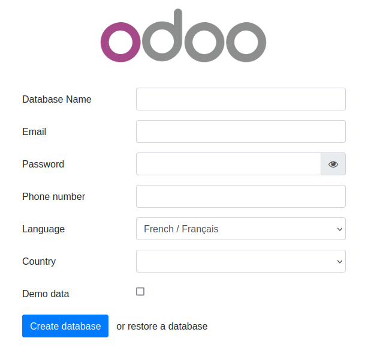
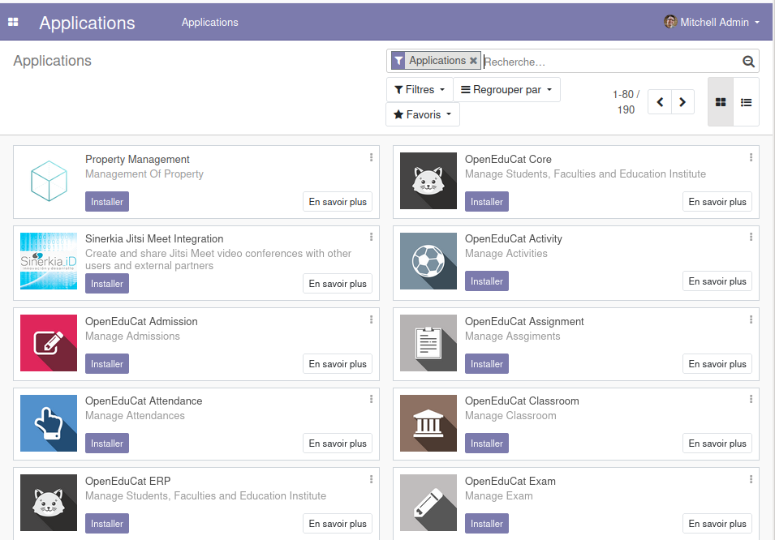

# ERPLibre

[](LICENSE)
[](https://github.com/ERPLibre/ERPLibre/tags)
[](https://github.com/ERPLibre/ERPLibre/stargazers)
[](https://github.com/ERPLibre/ERPLibre/graphs/contributors)
[](https://github.com/ERPLibre/ERPLibre/pulse)
[](https://github.com/ERPLibre/ERPLibre/commits)
[](https://fosstodon.org/@erplibre)


**The free, sovereign ERP/CRM that comes with its whole toolbox.**

Odoo Community delivers the software. ERPLibre delivers everything needed to
run it for years: a one-command install on ten platforms, eleven Odoo versions
side by side, guided database migration from one version to the next, a module
generator, deployment to containers, virtual machines or Proxmox, and an AI
assistant that can run entirely on your own hardware.

Your data stays where you put it. The modules come from the Odoo Community
Association (OCA) and an ecosystem of specialized companies, pinned and
reproducible. Every change ERPLibre makes to Odoo or to those modules is meant
to go back upstream.


# ERPLibre in numbers

The badges above are live. The table below was measured on version 1.8.0.


| | |
|---|---|
| **11** Odoo versions | from 10.0 to 20.0, installable side by side |
| **3,300+** modules | installable on Odoo 18, from **137** Git repositories |
| **23** organizations | supply those repositories; the OCA alone supplies **109** |
| **10** platforms | Linux distributions, macOS, Windows — on amd64, arm64 and s390x |
| **400+** commands | in the interactive TODO menu, in English and French |
| **6,700+** tests | guard the tooling, from menu numbering to virtual machine installs |
| **1,500+** commits | since 2020, **845** of them over the last twelve months |


# Features

### Install anywhere, in one command

`make` detects the system, installs what is missing and opens **TODO**, a
guided menu that drives everything below — no command to memorize. Ubuntu,
Debian, Fedora, AlmaLinux, openSUSE, Arch, NixOS (declaratively), macOS and
Windows, on three architectures. The Docker images, which Podman runs too,
ship with PostgreSQL 18 and PostGIS.

### Every Odoo version, side by side

Odoo 10.0 to 20.0 each get their own Python and virtual environment, managed
by mise or pyenv. Switch with `make switch_odoo_18`; the other versions stay
installed.

### Migrate forward without starting over

A guided database migration climbs one Odoo version at a time with
OpenUpgrade, keeps its progress, resumes after an interruption and can rewind
to a previous step. A production database can be neutralized into a safe
development copy.

### Build modules faster

The code generator produces complete Odoo modules — views, portal, snippets,
inheritance, i18n, JavaScript — or clones an existing one. Formatting, Git
hooks, per-module tests with coverage and Selenium automation are one menu
away.

### Deploy and operate

Deploy locally, in QEMU/KVM virtual machines or on Proxmox VE. Nginx, Apache,
Certbot SSL, dynamic DNS and systemd services are configured for you. VPN, SSH,
KeePass secrets and a dependency security audit are built in.

### Understand and transform your data

Back up, restore and clone databases; analyse a database's models, views and
custom fields; transform and anonymize data before sharing it.

### AI, local first

Ask a local or remote language model from the terminal, discover the model
servers on your network, and use AI-assisted development tools. Commits made
with AI are declared, never hidden — see [AI_POLICY](AI_POLICY.md).

### And more

ERPLibre Home Mobile (Owl + Capacitor), a terminal mail client, performance
measurement and parallel test execution.


# Supported Odoo versions


| Odoo version | Python  | Status     |
|--------------|---------|------------|
| 20.0         | 3.14.7  | Upstream   |
| 19.0         | 3.12.10 | Upstream   |
| 18.0         | 3.12.10 | Active     |
| 17.0         | 3.10.18 | Inactive   |
| 16.0         | 3.10.18 | Inactive   |
| 15.0         | 3.8.20  | Deprecated |
| 14.0         | 3.8.20  | Deprecated |
| 13.0         | 3.7.17  | Deprecated |
| 12.0         | 3.7.17  | Deprecated |
| 11.0         | 3.7.17  | Upstream, deprecated |
| 10.0         | 2.7.18  | Upstream, deprecated |


**Upstream** versions carry the Odoo and OCA repositories only, plus the
neutralization modules; they serve as migration steps.

Switch between versions with `make switch_odoo_18`, `make switch_odoo_16`, etc.

The Python in that table is the one of the Odoo virtual environment. The
tooling virtual environment `.venv.erplibre` (TODO, `repo`, formatters) runs
its own interpreter, **3.14.7**, set by `conf/python-erplibre-version`. Where a
distribution does not carry it, pyenv compiles it.


# Supported platforms

- **Ubuntu** : 24.04, 25.10, 26.04 — 20.04 and 22.04 are dropped, pikepdf requiring a qpdf 12.2 built in C++20
- **Linux Mint** : 22.3
- **Debian** : 12 (bookworm) and 13 (trixie)
- **Fedora** : 41 and later
- **AlmaLinux, Rocky Linux** : 9 and 10 — RHEL and CentOS Stream take the same path
- **openSUSE** : Leap 16.0 and Tumbleweed
- **Arch Linux** : rolling release
- **NixOS** : 25.11 — the dependencies are DECLARED in `conf/nixos/erplibre.nix` and applied by `nixos-rebuild`, where the four other families install them one command at a time
- **macOS** : through mise or pyenv
- **Windows** : through WSL or Docker
- **Architectures** : amd64, arm64 and s390x (IBM Z mainframe)


# Installation in production

## Easy installation on Ubuntu or Debian using Docker

This has been tested in Debian 12 and Ubuntu 24.04 LTS.

**Note** : This is meant for a test environment, on a local network or similar environment not directly exposed to the
Internet.


1. Make sure Docker and nginx web server are installed:<BR>
   `sudo apt install docker.io docker-compose-v2 nginx`
1. Get the latest ERPLibre Docker compose file:<BR>
   `wget https://raw.githubusercontent.com/ERPLibre/ERPLibre/master/docker-compose.yml`
1. Install and run ERPLibre with Docker running as a daemon (web server):<BR>
   `sudo docker compose up -d`
1. Open the final installation step at this web page :<BR>
   `http://[server IP]:8069/web/database/manager`<BR>
   
1. Finish the installation by providing a database name, email and password. then click on **Create Database**.
   Depending on your system resources **this may take more than 2 minutes without feedback !** Check your browser
   loading indicator.
1. Next, the web page will reload itself, and you should see the Applications list in ERPLibre:<BR>
   

   You can now personalize your ERPLibre installation.


For more information, read [Docker guide](./docker/README.md).

## Install from source code

### Automated installation


For Debian/Ubuntu


```bash
sudo apt install make python3
```


Clone the project:


```bash
git clone https://github.com/ERPLibre/ERPLibre.git
cd ERPLibre
```


Follow the instruction on the following script, it will try to detect your environment.


```bash
make
```


`make` and `./install.sh` start TODO through the interpreter that can read it:
`.venv.erplibre` when it carries the right version, otherwise the system
`python3` when it is recent enough, otherwise the install itself — a system
older than `conf/python-erplibre-version` cannot parse the code, so it offers
the install rather than stopping on a syntax error. The install runs only on a
yes typed in a terminal (`o`, `oui`, `y` or `yes`); Enter alone, or no
terminal, means no. When the
environment is missing but the system Python suffices, TODO offers to run
`./script/install/install_erplibre.sh` (in a terminal) or prints that command. The install builds the environment
through `EL_PYTHON_PROVIDER` (mise or pyenv); an existing `.venv.erplibre` on
another Python version is DELETED and rebuilt, and whatever was installed in it
by hand goes with it.


### Manually

Into Ubuntu, minimal dependency:


```bash
sudo apt install make git curl
```


Into Ubuntu, developer dependency:


```bash
sudo apt install make build-essential libssl-dev zlib1g-dev libreadline-dev libsqlite3-dev curl llvm libncurses5-dev libncursesw5-dev xz-utils tk-dev liblzma-dev libbz2-dev libldap2-dev libsasl2-dev
```


Clone the project:


```bash
git clone https://github.com/ERPLibre/ERPLibre.git
cd ERPLibre
```


`make install_os` detects the distribution and picks the right dependency script: apt for Ubuntu, Linux Mint and Debian, dnf for Fedora and the RHEL family, zypper for openSUSE, pacman for Arch, and a declarative module for NixOS. See the supported platforms above.


```bash
make install_os
make install_odoo_18
```


Install a specific Odoo version:


```bash
make install_odoo_16
make install_odoo_17
make install_odoo_18
```


Update your configuration if you need to run from another interface than 127.0.0.1, file `config.conf`


```
xmlrpc_interface = 0.0.0.0
```


Show version :


```bash
make version
```


Ready to execute:


```bash
make run
```


# Migrate a database between Odoo versions

From a fresh clone, TODO installs every Odoo version from 10 to 20, then opens
the database migration. Each `>` line is a key to type, followed by Enter:

```text
git clone https://github.com/ERPLibre/ERPLibre.git
cd ERPLibre
make
> 2   Install (make also installs ERPLibre locally and on the system)
> y   Install the system dependencies first (n if already done)
> w   Install every Odoo version, from 10 to 20
> 1   Execute
> 1   Code
> 7   Update
> 2   Upgrade Odoo - Migration Database
```

At the end of the installation, TODO returns to the main menu: `0` there
quits instead of going back. The key numbers are those of a fresh clone; an
entry added to `code_from_makefile` or `update_from_makefile` in a private
`todo.json` shifts them.

`test/test_guide_migration.py` replays this sequence, read from this file,
against the real menus. Run it after changing a menu:

```bash
.venv.erplibre/bin/python -m unittest test.test_guide_migration
```

The migration itself is described in [MIGRATION](doc/MIGRATION.md).


# Test

Execute ERPLibre test with his code generator.


```bash
time make test_full_fast
```


# Documentation

| Guide | Description |
|-------|-------------|
| [DISCOVER](doc/DISCOVER.md) | Learn and explore ERPLibre |
| [DEVELOPMENT](doc/DEVELOPMENT.md) | Development environment setup |
| [PRODUCTION](doc/PRODUCTION.md) | Production server deployment |
| [RUN](doc/RUN.md) | Execution modes and use cases |
| [CODE_GENERATOR](doc/CODE_GENERATOR.md) | Odoo module code generation |
| [MIGRATION](doc/MIGRATION.md) | Database migration between versions |
| [GIT_REPO](doc/GIT_REPO.md) | Git repository management |
| [POETRY](doc/POETRY.md) | Python dependency management |
| [FAQ](doc/FAQ.md) | Frequently asked questions |
| [HOWTO](doc/HOWTO.md) | How-to guides |
| [WINDOWS_INSTALLATION](doc/WINDOWS_INSTALLATION.md) | Windows installation |


# Community

ERPLibre has been built in the open since 2020, in English and French, by
developers, integrators and users who run it in production. It stands on the
work of the [Odoo Community Association](https://odoo-community.org), whose
repositories make up most of its modules, and gives its fixes back upstream.

- **Follow** the project on [Mastodon](https://fosstodon.org/@erplibre).
- **Ask or report** through [GitHub issues](https://github.com/ERPLibre/ERPLibre/issues).
- **Contribute** code, translations or documentation: start with
  [CONTRIBUTION](doc/CONTRIBUTION.md), which also thanks the people and
  organizations behind the project.
- **Use AI openly**: [AI_POLICY](AI_POLICY.md) explains how AI-assisted
  contributions are declared.


# License

This project is licensed under the [GNU Affero General Public License v3.0](LICENSE).
