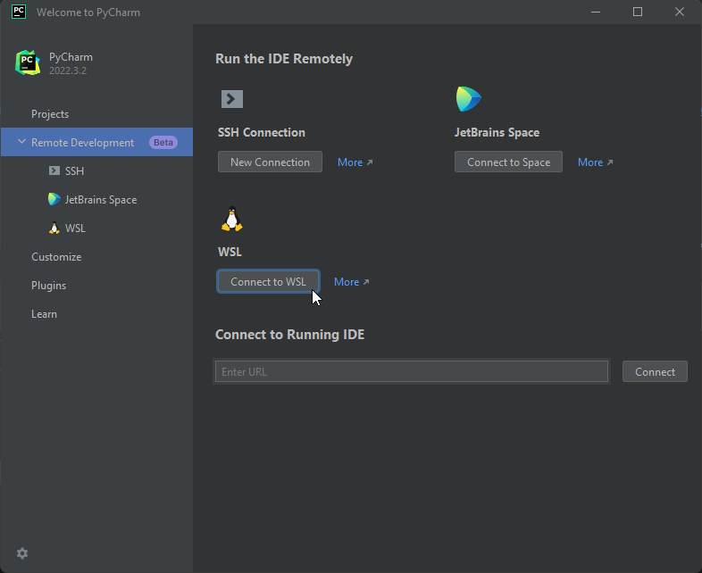
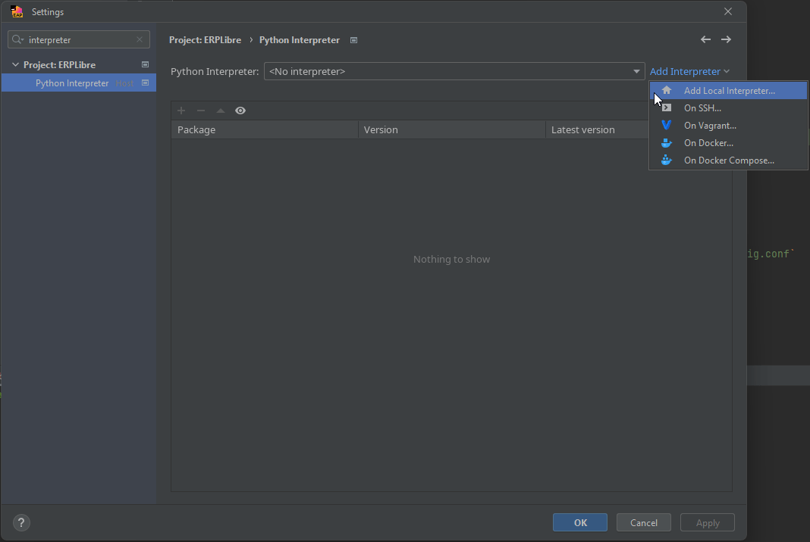
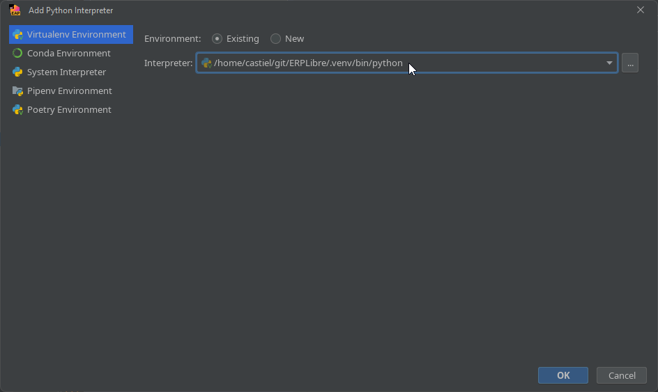
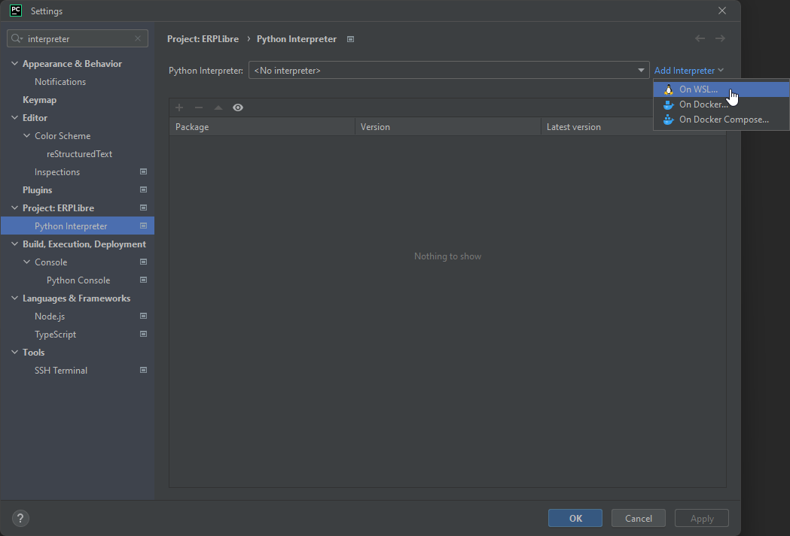
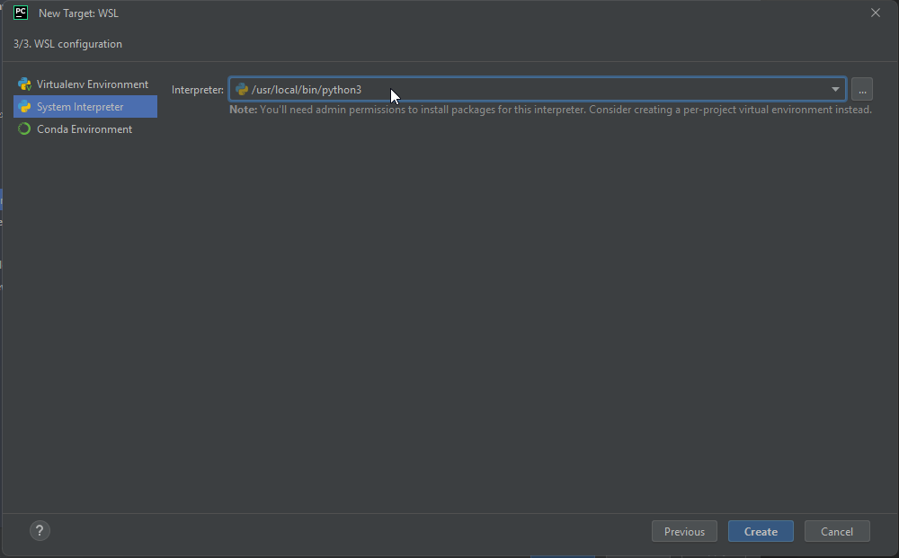
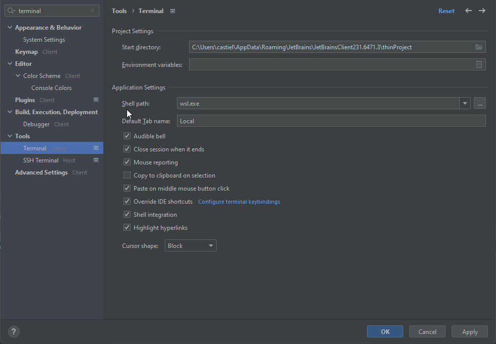

# Windows 10 version 2004 et plus ou 11 - publication et développement

Un guide pour configurer un espace de travail et exécuter ERPLibre sur Windows 10 version 2004 et plus ou Windows 11. Il existe deux méthodes d'installation, une automatique et l'autre manuelle.

**"WSL2 Ubuntu 22.04" sera désigné par "WSL2"**

**"PyCharm Professional" sera désigné par "PyCharm"**

## Installer WSL2

Exécutez Powershell avec les droits administrateur et lancez la commande suivante :

```bash
wsl --install -d Ubuntu-22.04
```

Si vous avez des difficultés à ouvrir Powershell avec les droits administrateur, appuyez sur `Windows + R`, entrez la ligne suivante et appuyez sur `OK`. Les droits administrateur vous seront automatiquement demandés.

```bash
powershell.exe
```

### Dépannage - Optionnel
Si vous rencontrez des problèmes, activez les options de virtualisation dans le BIOS si disponibles (hyper-v, vt-x, etc). Recherchez `Activer ou désactiver des fonctionnalités Windows` dans la barre de recherche Windows et assurez-vous que `Sous-système Windows pour Linux` est activé avant de redémarrer votre machine.

Vous pouvez aussi essayer ces commandes powershell :

```bash
dism.exe /online /enable-feature /featurename:VirtualMachinePlatform /all /norestart
wsl --set-default-version 2
```

Téléchargez et installez le dernier package de mise à jour du noyau Linux de Microsoft avec le [lien](https://wslstorestorage.blob.core.windows.net/wslblob/wsl_update_x64.msi) suivant :

```bash
https://wslstorestorage.blob.core.windows.net/wslblob/wsl_update_x64.msi
```

N'exécutez cette commande qu'en dernier recours car elle peut casser d'autres machines virtuelles :

```bash
bcdedit /set hypervisorlaunchtype auto
```

### Autres méthodes d'installation pour WSL2

Exécutez Powershell avec les droits administrateur et lancez la commande suivante :

```bash
curl.exe -L -o ubuntu-2004.appx https://aka.ms/wslubuntu2004
```

Exécutez Powershell avec les droits administrateur et lancez les commandes suivantes :

```bash
Invoke-WebRequest -Uri https://aka.ms/wslubuntu2004 -OutFile Ubuntu.appx -UseBasicParsing
Add-AppxPackage .\Ubuntu.appx
```

Installez WSL2 depuis le Microsoft Store avec le [lien](https://apps.microsoft.com/store/detail/ubuntu-22041-lts/9PN20MSR04DW) suivant :

```bash
https://apps.microsoft.com/store/detail/ubuntu-22041-lts/9PN20MSR04DW
```

## Configurer WSL2 pour ERPLibre

Une fois WSL2 installé correctement, redémarrez votre ordinateur.

### Vous pouvez ouvrir votre Ubuntu de plusieurs façons :

* Recherchez "Ubuntu" en cliquant sur la touche Windows
* [Téléchargez le Terminal Windows depuis le Microsoft Store](https://apps.microsoft.com/store/detail/windows-terminal/9N0DX20HK701)

Si vous utilisez le Terminal Windows, vous n'avez qu'à cliquer sur la petite flèche à côté du signe + et vous verrez Ubuntu.


### Configurer une interface graphique pour votre Ubuntu

1. Mettre à jour votre Ubuntu

```bash
sudo apt-get update -y && sudo apt-get upgrade -y
```

2. Installer le bureau XFCE4

```bash
sudo apt install -y xrdp xfce4 xfce4-goodies
```

3. Configurer le bureau

```bash
sudo cp /etc/xrdp/xrdp.ini /etc/xrdp/xrdp.ini.bak
sudo sed -i 's/3389/3390/g' /etc/xrdp/xrdp.ini
sudo sed -i 's/max_bpp=32/#max_bpp=32\nmax_bpp=128/g' /etc/xrdp/xrdp.ini
sudo sed -i 's/xserverbpp=24/#xserverbpp=24\nxserverbpp=128/g' /etc/xrdp/xrdp.ini
echo xfce4-session > ~/.xsession
```

4. Configurer la connexion Bureau à distance

```bash
sudo nano /etc/xrdp/startwm.sh
```

Commentez ces lignes avec un #

```bash
test -x /etc/X11/Xsession && exec /etc/X11/Xsession
exec /bin/sh /etc/X11/Xsession
```

Ajoutez cette ligne à la fin du fichier

```bash
startxfce4
```

Quittez avec Ctrl+S, Ctrl+X

5. Démarrer l'interface graphique du bureau Ubuntu

Ouvrez le terminal Ubuntu sur votre Windows et entrez cette commande

```bash
sudo /etc/init.d/xrdp start
```

Ensuite ouvrez *Connexion Bureau à distance* en cliquant sur la touche Windows et connectez-vous à *localhost:3390*

### Mémoire - Optionnel
Si WSL utilise trop de mémoire, vous pouvez la réduire avec une étape simple.
Il suffit d'aller dans *C:\Users\VotreNomUtilisateur\.wslconfig* et de créer un fichier *.wslconfig* et d'écrire :

```bash
sudo /etc/init.d/xrdp start

[wsl2]
memory=3GB
```

### Installation des outils nécessaires et à jour

```bash
sudo apt update
sudo apt install build-essential zlib1g-dev libncurses5-dev libgdbm-dev libnss3-dev libssl-dev libsqlite3-dev libreadline-dev libffi-dev curl libbz2-dev rsync make git
```

## Installation d'ERPLibre sous WSL2

Assurez-vous d'être dans le répertoire où vous souhaitez cloner le projet.

```bash
git clone https://github.com/ERPLibre/ERPLibre.git
cd ERPLibre
make install
```

Ajoutez un rôle à PostgreSQL, changez le champ `USERNAME` dans la commande avec votre nom d'utilisateur UNIX de votre environnement WSL2.

```bash
sudo service postgresql start
sudo su - postgres -c "createuser -s USERNAME" 2>/dev/null || true
```

## Problèmes courants lors de l'installation

### Erreur lors de `make install`
Assurez-vous que toutes les dépendances sont installées correctement. Relancez la commande suivante pour corriger les dépendances cassées :

```bash
sudo apt-get install -f
```

### PostgreSQL ne démarre pas
Vérifiez le statut du service PostgreSQL avec la commande suivante :

```bash
sudo service postgresql status
```

Si PostgreSQL ne fonctionne pas, essayez de le redémarrer avec :

```bash
sudo service postgresql restart
```


## Exécuter ERPLibre

À chaque redémarrage de votre machine, la commande suivante doit être exécutée pour démarrer le service PostgreSQL s'il n'est pas déjà en cours d'exécution :

```bash
sudo service postgresql start
```

Ensuite lancez cette commande à la racine du projet :

```bash
./run.sh
```

## Vérification d'ERPLibre
Pendant qu'ERPLibre est en cours d'exécution, assurez-vous que vous pouvez vous connecter à l'URL suivante `http://localhost:8069` et que vous avez la possibilité de créer, modifier et supprimer des bases de données.

## Configurer l'environnement de développement - PyCharm

### Installer PyCharm

Installez PyCharm depuis le [lien](https://www.jetbrains.com/pycharm/download/#section=windows) suivant :

```bash
https://www.jetbrains.com/pycharm/download/#section=windows
```

### Configurer Pycharm

Sélectionnez `Connect to WSL` sous `Remote Development`. Ensuite sélectionnez votre instance Ubuntu ("Ubuntu-22.04"). Pointez `Project directory` vers la racine du projet. Une fois que tout a été sélectionné et rempli correctement, cliquez sur `Start IDE and Connect`.



Appuyez sur `CTRL+ALT+S`, recherchez `interpreter` et dans la page `Python Interpreter`, cliquez sur `Add Interpreter` et sélectionnez `Add Local Interpreter...`.



Assurez-vous de sélectionner `Virtualenv Environment` à gauche et le bouton radio `Existing`. Une fois les deux correctement sélectionnés, pointez votre interpréteur vers le répertoire `../ERPLibre/.venv/bin/python` du projet et cliquez sur `OK`.



Si ces dernières étapes pour configurer votre environnement de développement n'ont pas fonctionné, suivez les étapes "Manuelles" suivantes pour configurer votre environnement.

## Installation manuelle

### Installer Python 3.10.14
Vous pouvez supprimer les fichiers restants dans votre répertoire personnel concernant l'installation de Python une fois les étapes complétées avec succès.

```bash
cd ~
wget https://www.python.org/ftp/python/3.10.14/Python-3.10.14.tgz
tar -xzf Python-3.10.14.tgz
cd Python-3.10.14
./configure --enable-optimizations
make -j $(nproc)
sudo make install
```

### Vérifier l'installation

```bash
python3.10
```

### Définir Python 3.10.14 par défaut

```bash
alias python='/usr/local/bin/python3.10'
source ~/.bashrc
```

### Configurer Pycharm

Ouvrez le répertoire du projet dans PyCharm.

Appuyez sur `CTRL+ALT+S`, recherchez `interpreter` et dans la page `Python Interpreter`, cliquez sur `Add Interpreter` et sélectionnez `On WSL...`.



Attendez que PyCharm détecte votre instance WSL2 et appuyez sur `NEXT`. Cliquez sur `System Interpreter` à gauche, sélectionnez le bon interpréteur s'il ne l'a pas fait automatiquement et cliquez sur `Create`.



Fermez les paramètres du projet. Lorsque PyCharm vous propose d'importer des modules, autorisez-le.

## Problèmes courants avec le développement Windows

### Terminal cassé

Recherchez `terminal` dans les paramètres, et sous `Application Settings` dans le champ `Shell path:` entrez la ligne suivante :

```bash
wsl.exe
```



### Avertissements d'utilisation élevée de la mémoire
Si vous constatez une utilisation élevée de la mémoire, cliquez sur `Help` dans la barre d'outils et choisissez `Change Memory Settings` pour augmenter la mémoire allouée à l'IDE.

### Modules importés manquants ou incorrects
PyCharm peut ne pas reconnaître complètement certains détails de `requirements.txt` et `pyproject.toml` (par exemple, des versions spécifiques de modules). Si vous rencontrez des problèmes à l'exécution ou lors du débogage, recherchez la bonne version du module et réinstallez-le avec le gestionnaire de paquets de PyCharm.

### Impossible d'exécuter ERPLibre depuis PyCharm

Si ERPLibre ne se lance pas depuis PyCharm, exécutez la commande suivante dans le répertoire racine du projet depuis le terminal de PyCharm ou WSL2 :

```bash
./script/ide/pycharm_configuration.py
```

### Impossible de redémarrer ERPLibre
Lancez `htop` depuis le terminal de PyCharm ou WSL2 et fermez les processus Python liés à ERPLibre pour libérer le socket.

## Références
[Installation de WSL](https://learn.microsoft.com/en-us/windows/wsl/install)
Guide complet sur l'installation du Sous-système Windows pour Linux (WSL) sur Windows.

[Documentation officielle de PostgreSQL](https://www.postgresql.org/docs/)
Documentation officielle de PostgreSQL pour le dépannage des problèmes courants et pour en apprendre davantage sur les commandes et la configuration de PostgreSQL.

[Installation et configuration de PyCharm](https://www.jetbrains.com/pycharm/quickstart/)
Guide de démarrage rapide pour la configuration de PyCharm, incluant la gestion des modules Python et la configuration de l'environnement.

[Dépannage de WSL](https://learn.microsoft.com/en-us/windows/wsl/troubleshoot)
Guide de dépannage pour les problèmes courants rencontrés avec WSL, fournissant des solutions pour divers problèmes qui peuvent survenir.

[Interface graphique Linux](https://hub.tcno.co/windows/wsl/desktop-gui/)
Instructions pour configurer une interface graphique (GUI) dans WSL, ce qui peut être utile pour une meilleure intégration des applications Linux.

[Problème de mémoire](https://www.aleksandrhovhannisyan.com/blog/limiting-memory-usage-in-wsl-2/)
Guide sur la gestion et la limitation de l'utilisation de la mémoire dans WSL 2 pour éviter les problèmes de consommation élevée de mémoire.