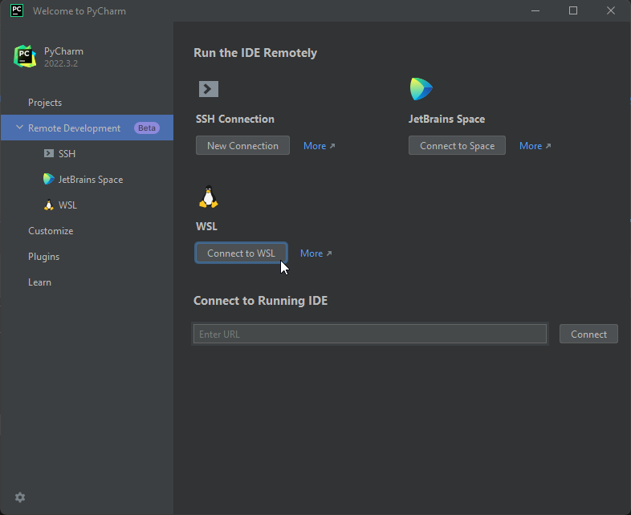
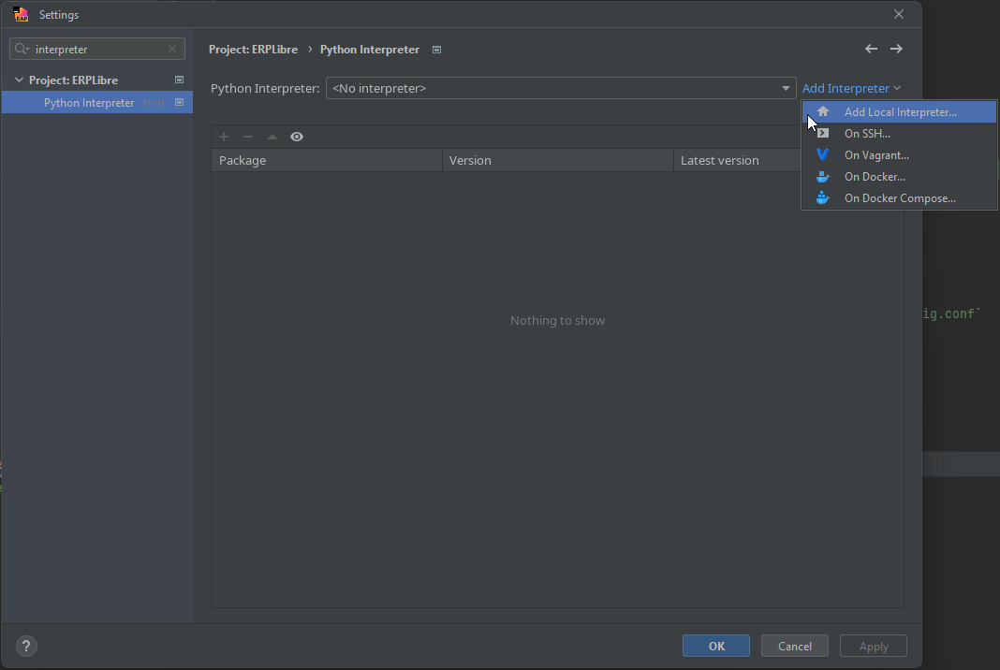
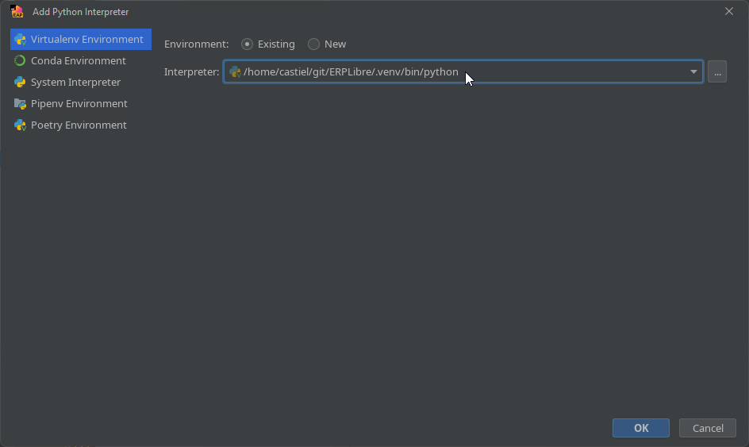
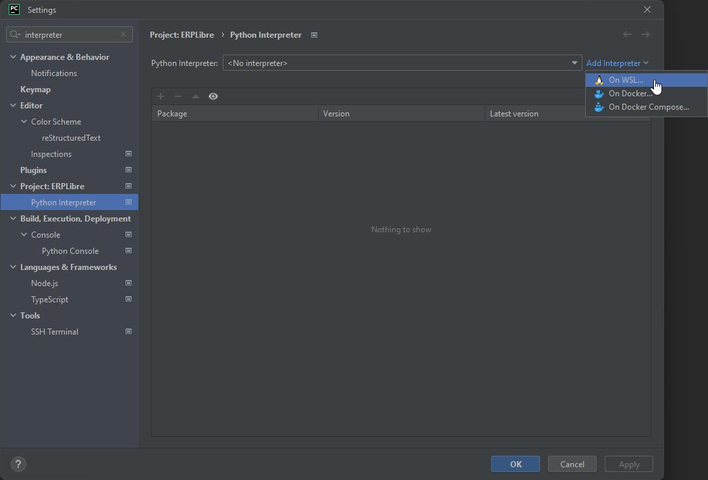
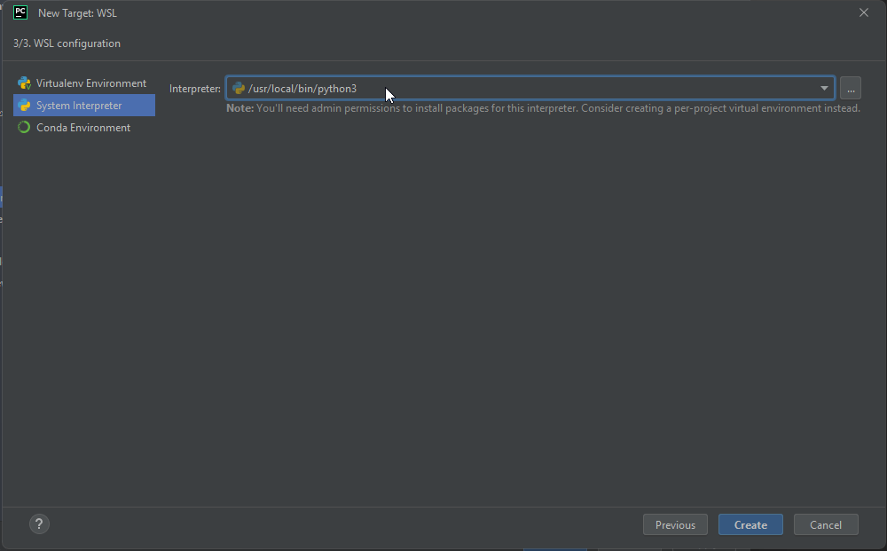
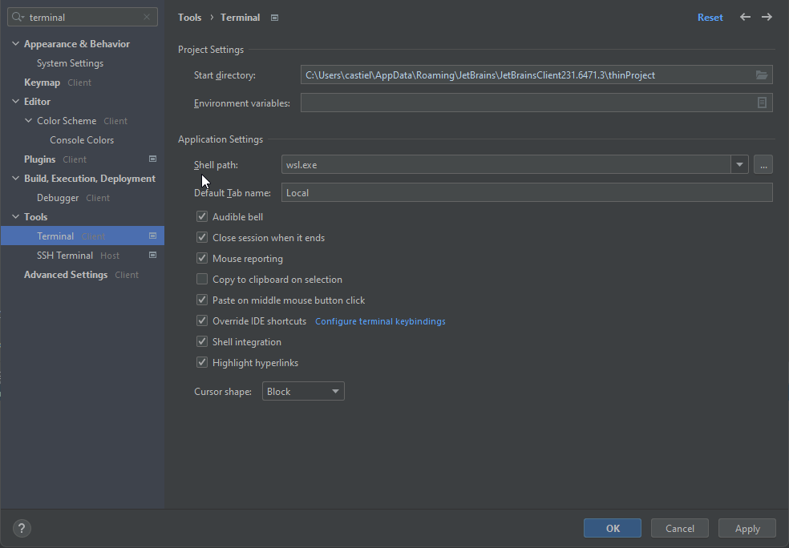

# Windows 10 version 2004 and up or 11 - release and development

A guide on how to set up a workspace and run ERPLibre on Windows 10 version 2004 and up or Windows 11. There are two methods of installation, one is automatic and the other manual.

**"WSL2 Ubuntu 22.04" will be referred as "WSL2"**

**"PyCharm Professional" will be referred as "PyCharm"**

## Install WSL2

Run Powershell with administrator rights and run the following command:

```bash
wsl --install -d Ubuntu-22.04
```

If you have trouble opening the Powershell with administrator rights, press `Windows + R`, enter the following line and press `OK`. You will be automatically prompted for administrator rights.

```bash
powershell.exe
```

### Troubleshooting - Optional
If you have issues enable virtualization options in BIOS is available (hyper-v, vt-x, etc). Search for `Turn Windows features on or off` in the Windows search bar and ensure that `Windows Subsystem for Linux` is turned on before restarting your machine.

You can also try theses powershell commands:

```bash
dism.exe /online /enable-feature /featurename:VirtualMachinePlatform /all /norestart
wsl --set-default-version 2
```

Download and install the lastest Linux kernel update package from Microsoft with the following [link](https://wslstorestorage.blob.core.windows.net/wslblob/wsl_update_x64.msi):

```bash
https://wslstorestorage.blob.core.windows.net/wslblob/wsl_update_x64.msi
```

Only run this command as your last resort as it can break other virtual machines:

```bash
bcdedit /set hypervisorlaunchtype auto
```

### Other Installation methods for WSL2

Run Powershell with administrator rights and run the following command:

```bash
curl.exe -L -o ubuntu-2004.appx https://aka.ms/wslubuntu2004
```

Run Powershell with administrator rights and run the following commands:

```bash
Invoke-WebRequest -Uri https://aka.ms/wslubuntu2004 -OutFile Ubuntu.appx -UseBasicParsing
Add-AppxPackage .\Ubuntu.appx
```

Install WSL2 from the Microsoft Store with the following [link](https://apps.microsoft.com/store/detail/ubuntu-22041-lts/9PN20MSR04DW):

```bash
https://apps.microsoft.com/store/detail/ubuntu-22041-lts/9PN20MSR04DW
```

## Setup WSL2 for ERPLibre

Once WSL2 has been installed correctly, reboot your computer.

### You can open your Ubuntu many ways:

* Search "Ubuntu" by clicking the Windows key
* [Download the Windows Terminal from the Microsoft Store](https://apps.microsoft.com/store/detail/windows-terminal/9N0DX20HK701)

If you are using the Windows Terminal, you just have to click the little arrow next to the + sign and then you will see Ubuntu.


### Setup a GUI for you Ubuntu

1. Update your Ubuntu

```bash
sudo apt-get update -y && sudo apt-get upgrade -y
```

2. Install the XFCE4 Desktop

```bash
sudo apt install -y xrdp xfce4 xfce4-goodies
```

3. Setup the Desktop

```bash
sudo cp /etc/xrdp/xrdp.ini /etc/xrdp/xrdp.ini.bak
sudo sed -i 's/3389/3390/g' /etc/xrdp/xrdp.ini
sudo sed -i 's/max_bpp=32/#max_bpp=32\nmax_bpp=128/g' /etc/xrdp/xrdp.ini
sudo sed -i 's/xserverbpp=24/#xserverbpp=24\nxserverbpp=128/g' /etc/xrdp/xrdp.ini
echo xfce4-session > ~/.xsession
```

4. Setup the Remote Desktop Connection

```bash
sudo nano /etc/xrdp/startwm.sh
```

Comment these lines with a #

```bash
test -x /etc/X11/Xsession && exec /etc/X11/Xsession
exec /bin/sh /etc/X11/Xsession
```

Add this line at the end of the file

```bash
startxfce4
```

Exit with Ctrl+S, Ctrl+X

5. Starting Ubuntu Desktop GUI

Open Ubuntu Terminal on your Windows and enter this command

```bash
sudo /etc/init.d/xrdp start
```

Then open *Remote Desktop Connection* by clicking the Windows key and connect to *localhost:3390*

### Memory - Optional
If WSL is taking too much memory, you can reduce with an easy step.
You just have to go to *C:\Users\YourUsername\.wslconfig* and create a *.wslconfig* file and write:

```bash
sudo /etc/init.d/xrdp start

[wsl2]
memory=3GB
```

### Installation of the necessary and up-to-date tools

```bash
sudo apt update
sudo apt install build-essential zlib1g-dev libncurses5-dev libgdbm-dev libnss3-dev libssl-dev libsqlite3-dev libreadline-dev libffi-dev curl libbz2-dev rsync make git
```

## Installation of ERPLibre under WSL2

Make sure to be in the directory where you want to clone the project.

```bash
git clone https://github.com/ERPLibre/ERPLibre.git
cd ERPLibre
make install
```

Add role to PostgresSQL, change `USERNAME` field in the command with your UNIX username from your WSL2 environment.

```bash
sudo service postgresql start
sudo su - postgres -c "createuser -s USERNAME" 2>/dev/null || true
```

## Common Problems During Installation

### Error During `make install`
Ensure all dependencies are installed correctly. Re-run the following command to fix any broken dependencies:

```bash
sudo apt-get install -f
```

### PostgreSQL Not Starting
Check the PostgreSQL service status with the following command:

```bash
sudo service postgresql status
```

If PostgreSQL is not running, try restarting it with:

```bash
sudo service postgresql restart
```


## Running ERPLibre

Everytime you restart your machine, the following command has to be executed to start the PostgreSQL service if it is not already running:

```bash
sudo service postgresql start
```

After that run this command in the root of the project:

```bash
./run.sh
```

## Verifying ERPLibre
While ERPLibre is running, make sure that you can connect to the following URL `http://localhost:8069` and have the ability to create, modify and remove databases.

## Set up Development Environment - PyCharm

### Install PyCharm

Install PyCharm from the following [link](https://www.jetbrains.com/pycharm/download/#section=windows):

```bash
https://www.jetbrains.com/pycharm/download/#section=windows
```

### Set up Pycharm

Select `Connect to WSL` under `Remote Development`. After that select your Ubuntu instace ("Ubuntu-22.04"). Point `Project directory` to the root of the project. Once everything has been selected and filled out correctly, click on `Start IDE and Connect`.



Press `CTRL+ALT+S`, search for `interpreter` and inside the `Python Interpreter` page, click on `Add Interpreter` and select `Add Local Interpreter...`.



Make sure to select `Virtualenv Environment` on the left and the `Existing` radio button. Once theses are both selected properly, point your interpreter to the `../ERPLibre/.venv/bin/python` directory of the project and click on `OK`.



If these last steps to set up your development environment were unsuccessful, follow the next "Manual" steps to set up your environment.

## Manual Installation

### Install Python 3.10.14
You can delete the files that are left over in your home directory regarding the python installation when the steps have been completed succesfully.

```bash
cd ~
wget https://www.python.org/ftp/python/3.10.14/Python-3.10.14.tgz
tar -xzf Python-3.10.14.tgz
cd Python-3.10.14
./configure --enable-optimizations
make -j $(nproc)
sudo make install
```

### Verify the installation

```bash
python3.10
```

### Set Python 3.10.14 as default

```bash
alias python='/usr/local/bin/python3.10'
source ~/.bashrc
```

### Set up Pycharm

Open the project directory in PyCharm.

Press `CTRL+ALT+S`, search for `interpreter` and inside the `Python Interpreter` page, click on `Add Interpreter` and select `On WSL...`.



Wait until PyCharm detects your WSL2 instance and press `NEXT`. Click on `System Interpreter` on the left, select the correct interpreter if it hasn't done so automatically and click `Create`.



Close the project's settings. Once PyCharm prompts you to import modules and allow it.

## Common problems with Windows Development

### Broken Terminal

Search for `terminal` in the settings, and under `Application Settings` in the `Shell path:` field enter the following line:

```bash
wsl.exe
```



### High Memory Usage warnings
If you experience high memory usage, click on `Help` in the toolbar and choose `Change Memory Settings` to increase the memory heap of the IDE.

### Missing or incorrect imported modules
PyCharm might not fully recognize some details from `requirements.txt` and `pyproject.toml` (e.g., specific module versions). If you encounter issues at runtime or while debugging, search for the correct version of the module and reinstall it using PyCharm's package manager.

### Can't run ERPLibre from PyCharm

If ERPLibre fails to run from PyCharm, execute the following command in the root directory of the project from the terminal in PyCharm or WSL2:

```bash
./script/ide/pycharm_configuration.py
```

### Can't restart ERPLibre
Run `htop` from the terminal in PyCharm or WSL2 and close the python processes related to ERPLibre to release the socket.

## References
[WSL Installation](https://learn.microsoft.com/en-us/windows/wsl/install)
Comprehensive guide on installing Windows Subsystem for Linux (WSL) on Windows.

[PostgreSQL Official Documentation](https://www.postgresql.org/docs/)
Official PostgreSQL documentation for troubleshooting common issues and learning more about PostgreSQL commands and configuration.

[PyCharm Installation and Configuration](https://www.jetbrains.com/pycharm/quickstart/)
Quick start guide for setting up and configuring PyCharm, including handling Python modules and environment setup.

[WSL Troubleshooting](https://learn.microsoft.com/en-us/windows/wsl/troubleshoot)
Troubleshooting guide for common issues encountered in WSL, providing solutions for various problems that may arise.

[Linux GUI](https://hub.tcno.co/windows/wsl/desktop-gui/)
Instructions for setting up a graphical user interface (GUI) in WSL, which might be helpful for better integration of Linux applications.

[Memory Problem](https://www.aleksandrhovhannisyan.com/blog/limiting-memory-usage-in-wsl-2/)
Guide on how to manage and limit memory usage in WSL 2 to avoid high memory consumption issues.
